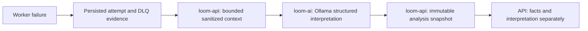

# Conductor

**Conductor evolves [Project Loom](https://github.com/tarunkishore2303/project-loom) into an intelligent distributed workflow platform.** This repository preserves Loom's original Git history. The orchestration modules retain their `loom-*` names while the platform evolves.

The current release includes an isolated Ollama-powered AI service for structured workflow generation, deterministic validation, preview, and explicit approval. Workers currently execute simulated no-op tasks.

See [runtime upgrade decisions and verification](docs/runtime-upgrade.md) for the
Spring Boot 4, Java 25, and Podman migration details.

Distributed async job orchestration engine — a portfolio workflow engine built with Spring Boot, Kafka, Redis, and PostgreSQL.

Submit a DAG of tasks via REST. Loom validates the graph, persists it, and executes tasks across horizontally-scaled workers with distributed locking, exponential backoff retry, dead-letter queuing, and real-time observability.

---

## AI Workflow Generation

Natural language becomes a structured proposal. Conductor validates its DAG,
stores a preview, and creates a normal workflow only after explicit approval.
**The LLM never controls scheduling or task execution.**

```mermaid
flowchart LR
    User[User prompt] --> AI[loom-ai / Ollama]
    AI --> Proposal[Structured proposal]
    Proposal --> Validator[loom-api / existing DAGValidator]
    Validator --> Preview[Stored preview]
    Preview --> Approval[Explicit user approval]
    Approval --> Revalidate[Revalidate]
    Revalidate --> Workflow[Existing WorkflowService / template]
    Workflow --> Execute[Separate normal execution request]
```



AI uses only local Ollama models, with no cloud API key. The optional `ai` Compose
profile starts `loom-ai` and Ollama; normal orchestration runs without them.
Spring AI 2.0.1 is scoped to `loom-ai` and is [compatible with Boot 4.1](https://docs.spring.io/spring-ai/reference/getting-started.html).
The provider sends a native JSON schema to Ollama and strictly validates output
types and bounds. `loom-ai` has no database credentials or Kafka execution
producer. Its separate process isolates model dependencies and timeouts from
orchestration; the tradeoff is one extra local service.

`loom-api` owns proposal persistence and Flyway migrations. Persisting the preview
ensures approval uses exactly the stored content. Approval locks the proposal,
revalidates it, and calls the existing `WorkflowService` in one transaction.
Proposals expire after 24 hours; duplicate approval returns 409. Approval never
starts execution. Original user prompts are not stored with proposals.

### Ollama setup

AI is disabled by default. The optional profile starts a local Ollama container
with a persistent model volume and no published model port. Enable AI and install
the model explicitly; starting Compose does not download model weights:

```powershell
$env:AI_ENABLED = 'true'
$env:AI_MODEL = 'qwen2.5-coder:7b'
.\scripts\compose.ps1 --profile ai up --build -d
.\scripts\compose.ps1 --profile ai exec ollama ollama pull qwen2.5-coder:7b
.\scripts\compose.ps1 --profile ai exec ollama ollama list
```

See [.env.example](.env.example) for Compose settings. `OLLAMA_BASE_URL` defaults
to `http://ollama:11434` in Compose and `http://localhost:11434` for a directly
launched Java service. Windows host Ollama normally listens only on loopback;
Podman may be unable to reach it through `host.containers.internal`, so the
container profile is the default. `AI_REQUEST_TIMEOUT` defaults to 120 seconds;
`AI_SERVICE_TIMEOUT` defaults to 130 seconds for the API. Temperature and output
token limits are configurable with `AI_TEMPERATURE` and `AI_MAX_TOKENS`.

### Preview, approval, and execution

```powershell
$body = @{ prompt = 'Create a workflow that downloads customer orders, validates them, generates invoices in parallel, uploads them and sends a notification.' } | ConvertTo-Json
$proposal = Invoke-RestMethod -Method Post -Uri 'http://localhost:8080/api/v1/ai/workflows/generate' -ContentType 'application/json' -Body $body -TimeoutSec 150
$proposal | ConvertTo-Json -Depth 20
```

Inspect the tasks and validation result. Retrieve the same preview with
`GET /api/v1/ai/workflows/proposals/{proposalId}`. Invalid graphs remain visible
with `validation.valid = false` and deterministic errors; they cannot be approved.
After reviewing a valid preview:

```powershell
$workflow = Invoke-RestMethod -Method Post -Uri "http://localhost:8080/api/v1/ai/workflows/proposals/$($proposal.proposalId)/approve"
Invoke-RestMethod -Uri "http://localhost:8080/api/v1/workflows/$($workflow.id)"
# Execution is a separate normal API request.
$job = Invoke-RestMethod -Method Post -Uri "http://localhost:8080/api/v1/workflows/$($workflow.id)/jobs" -ContentType 'application/json' -Body '{"name":"ai-workflow-demo"}'
Invoke-RestMethod -Uri "http://localhost:8080/api/v1/jobs/$($job.id)"
```

Invalid user requests return 400, malformed model output returns 422, and provider
unavailability/timeouts return 503. Normal workflow APIs continue operating during
AI outages. Model calls have bounded context/output and no automatic retries;
logs omit full prompts and raw provider errors.

The optional smoke script previews by default and can reuse an inspected proposal
without another model call:

```powershell
.\scripts\ai-workflow-smoke.ps1
.\scripts\ai-workflow-smoke.ps1 -ProposalId '<id from preview>' -Approve -Execute
```

Workers currently support only simulated `NOOP` tasks. Names describe intended
business operations; they do not download orders or generate invoices. Parallelism
is a fixed DAG, without schedules or dynamic fan-out. Human review remains
necessary: a valid graph does not guarantee the requested business semantics.
Authentication/tenant isolation and expired-proposal cleanup are deferred. RAG,
failure analysis, copilot, optimization, and frontend AI are outside this phase.

Verified on 2026-10-04: 54 unit tests and 18 Podman integration tests passed. The
real `qwen2.5-coder:7b` model generated the six-task orders DAG with two invoice
branches and a join; all tasks completed after explicit approval and execution.
No workflow template existed before approval. Duplicate approval returned 409;
with Ollama stopped, generation returned 503 while a manual workflow completed.
The successful CPU-only model call took about 78 seconds; local latency varies.

## AI Failure Analysis

Failure analysis keeps execution facts separate from model interpretation. All AI
runs locally through Ollama; no cloud APIs or API keys are used.



`POST /api/v1/ai/runs/{jobId}/analyze-failure` analyzes a failed, settled run.
`GET /api/v1/ai/runs/{jobId}/failure-analysis` retrieves the stored analysis without
calling Ollama. Repeating POST for an unchanged context reuses the persisted result.
Facts include recorded attempts, errors, timestamps, planned retry times, and DLQ
status. `interpretation` contains a likely cause, confidence, explanation, and
recommended actions. Confidence is a model assessment, not a calibrated probability.

The API retains database ownership; loom-ai receives bounded facts and has no
orchestration database credentials. V4 adds nullable execution evidence for backwards
compatibility; V5 stores analyses with a unique run/context fingerprint. Legacy
records may lack errors or attempt numbers. Console logs, workflow-template linkage,
external service health, and historical Kafka payloads are not fabricated as facts.
Unavailable evidence is explicit; a run without usable failure evidence is rejected.

For the controlled local demo, explicitly set `DEMO_FAILURES_ENABLED=true` when
starting both workers. Only `demoConnectionTimeout`, `demoDownstreamTimeout`, and
`demoInvalidJson` trigger fixed simulated errors; the default is disabled. Run:

```powershell
python scripts/failure-analysis-smoke.py
```

The smoke script creates a job, checks three failed attempts and terminal DLQ
evidence, requests analysis, and verifies cached reuse. Normal execution remains
separate from analysis. Retry scheduling still uses an in-memory executor; after-commit
Kafka publication avoids reading uncommitted evidence but is not a durable outbox.
Existing DLQ replay limitations are not repaired by AI analysis.

## Architecture

```
┌──────────────┐   POST /jobs    ┌─────────────────────┐
│    Client    │ ──────────────► │     loom-api         │  :8080
└──────────────┘                 │  DAG validation      │
                                 │  Job persistence      │
                                 │  Flyway migrations    │
                                 └─────────┬─────────────┘
                                           │ job-created (Kafka)
                                           ▼
                                 ┌─────────────────────┐
                                 │   loom-scheduler     │
                                 │  Reactive R2DBC      │
                                 │  Root task detection  │
                                 │  Downstream unblock   │
                                 │  Optimistic locking   │
                                 └─────────┬─────────────┘
                                           │ task-queue (Kafka)
                              ┌────────────┴────────────┐
                              ▼                          ▼
                    ┌──────────────────┐      ┌──────────────────┐
                    │  loom-worker-1   │      │  loom-worker-2   │  :8081 / :8082
                    │  Redisson lock   │      │  Redisson lock   │
                    │  Idempotency     │      │  Idempotency     │
                    │  Retry + DLQ     │      │  Retry + DLQ     │
                    └──────────────────┘      └──────────────────┘
                                           │ task-results (Kafka)
                                           ▼
                                 ┌─────────────────────┐
                                 │    loom-monitor      │  :8083
                                 │  Read-only stats     │
                                 │  DLQ browser         │
                                 └─────────────────────┘
```

### Services

| Service | Role | Port | Stack |
|---|---|---|---|
| `loom-common` | Shared entities, DTOs, Kafka events | — | JPA, Jackson |
| `loom-api` | REST API, DAG validation, job persistence | 8080 | Spring MVC, JPA, Flyway, Kafka producer |
| `loom-scheduler` | DAG execution engine, task scheduling | — | WebFlux, R2DBC, Kafka consumer |
| `loom-worker` | Task execution, retry, DLQ | 8081 / 8082 | Spring MVC, JPA, Redisson, Kafka |
| `loom-monitor` | Read-only stats and DLQ browser | 8083 | Spring MVC, JPA |
| `loom-ai` | Structured workflow proposals; no execution access | 8085 | Spring AI, Ollama, Spring MVC |

### Infrastructure

| Component | Purpose |
|---|---|
| PostgreSQL 15 | Persistent store — jobs, tasks, executions, workflow templates |
| Kafka + ZooKeeper | Event bus — `job-created`, `task-queue`, `task-results` |
| Redis | Distributed locks (Redisson) preventing duplicate task execution |
| Prometheus | Metrics scraping from all services |
| Grafana | Metrics dashboards |

---

## Key Design Decisions

- **DAG validation** — cycle detection (DFS) and unknown-dependency checks before any DB write
- **Post-commit Kafka publish** — `TransactionSynchronization.afterCommit()` ensures scheduler only sees persisted jobs
- **Reactive scheduler** — R2DBC + WebFlux for non-blocking DAG traversal under load
- **Distributed locking** — Redisson `tryLock` prevents two workers racing on the same task
- **Idempotent execution** — deterministic `executionId = UUID.nameUUIDFromBytes(taskId + attemptNumber)` guards against duplicate processing on retry
- **Exponential backoff** — retry delay = `2^attemptNumber` seconds, up to `maxRetries`
- **FAIL_FAST policy** — on max retries exhausted, cancels all PENDING tasks and marks job FAILED
- **Optimistic locking** — `version` column on both `jobs` and `tasks` prevents lost updates across concurrent workers

---

## Getting Started

### Prerequisites

- Podman + standalone Docker Compose (no Docker Desktop required)
- Java 25 (for local builds only)

### Windows setup

Run the WSL installation in Administrator PowerShell and restart if requested:

```powershell
wsl --install --no-distribution
winget install --id RedHat.Podman --exact
winget install --id Docker.DockerCompose --exact
```

In a new terminal (machine initialization is needed only once):

```powershell
podman machine init
podman machine start
.\gradlew.bat build
.\scripts\compose.ps1 up --build -d
```

The helper locates Podman and a standalone Docker Compose provider even when the
current terminal's PATH has not refreshed. Stop the stack with
`.\scripts\compose.ps1 down`; named volumes retain database data.

Testcontainers uses Podman's Docker-compatible API, not Docker Desktop. On Windows,
`podman machine start` exposes the default named pipe. Run container tests with
`.\gradlew.bat integrationTest`. On other platforms, configure `DOCKER_HOST` for
Podman's socket as described in the [Testcontainers runtime guide](https://java.testcontainers.org/supported_docker_environment/).
Do not disable Ryuk by default; it cleans up temporary test containers.

### Run on Linux/macOS

```bash
./gradlew build
PODMAN_COMPOSE_PROVIDER=docker-compose podman compose up --build -d
```

Services start in dependency order:
1. PostgreSQL, ZooKeeper, Kafka, Redis
2. loom-api (runs Flyway migrations)
3. loom-scheduler, loom-worker-1, loom-worker-2, loom-monitor
4. Prometheus, Grafana

### URLs

| Service | URL |
|---|---|
| API | http://localhost:8080 |
| Swagger UI | http://localhost:8080/swagger-ui.html |
| Monitor | http://localhost:8083/monitor/stats |
| Prometheus | http://localhost:9090 |
| Grafana | http://localhost:3000 (admin / admin) |

---

## API Reference

### Submit a Job

```bash
POST /api/v1/jobs
```

```json
{
  "name": "etl-pipeline",
  "failurePolicy": "FAIL_FAST",
  "tasks": [
    { "taskId": "a", "name": "Extract",   "dependsOn": [],         "maxRetries": 3 },
    { "taskId": "b", "name": "Transform", "dependsOn": ["a"],      "maxRetries": 3 },
    { "taskId": "c", "name": "Load",      "dependsOn": ["b"],      "maxRetries": 3 }
  ]
}
```

`failurePolicy` values:
- `FAIL_FAST` — first dead-lettered task cancels all pending tasks, job → FAILED
- `CONTINUE` — other tasks keep running; job → FAILED only when all terminal

### Other Endpoints

| Method | Path | Description |
|---|---|---|
| `GET` | `/api/v1/jobs/{jobId}` | Get job + task statuses |
| `DELETE` | `/api/v1/jobs/{jobId}` | Cancel job (→ CANCELLING) |
| `POST` | `/api/v1/workflows` | Create reusable workflow template |
| `GET` | `/api/v1/workflows/{templateId}` | Get workflow template |
| `POST` | `/api/v1/workflows/{templateId}/jobs` | Submit job from template |
| `GET` | `/api/v1/dlq` | List dead-lettered tasks |
| `POST` | `/api/v1/dlq/{taskId}/retry` | Re-queue a dead-lettered task |
| `GET` | `/monitor/stats` | Aggregated job + task counts by status |
| `GET` | `/monitor/dlq` | Paginated dead-letter queue view |

### Job + Task Statuses

```
Job:   CREATED → RUNNING → COMPLETE | FAILED | CANCELLED
Task:  PENDING → RUNNING → COMPLETE | FAILED → DEAD_LETTERED | CANCELLED
```

### Example — Diamond DAG

```bash
curl -s -X POST http://localhost:8080/api/v1/jobs \
  -H "Content-Type: application/json" \
  -d '{
    "name": "diamond",
    "failurePolicy": "CONTINUE",
    "tasks": [
      { "taskId": "a", "name": "Ingest",    "dependsOn": [],         "maxRetries": 2 },
      { "taskId": "b", "name": "Branch-1",  "dependsOn": ["a"],      "maxRetries": 2 },
      { "taskId": "c", "name": "Branch-2",  "dependsOn": ["a"],      "maxRetries": 2 },
      { "taskId": "d", "name": "Aggregate", "dependsOn": ["b", "c"], "maxRetries": 2 }
    ]
  }' | jq .
```

---

## Observability

The API, AI service, monitor, and workers expose Prometheus metrics at
`/actuator/prometheus`. The scheduler does not currently expose Actuator metrics.

Open the provisioned [Conductor application requests dashboard](http://localhost:3000/d/conductor-requests)
in Grafana (`admin` / `admin` for the local stack). It shows request counts and
rates, routes/methods/status codes, HTTP errors, API/AI p95 latency, and AI
generation counts, failures, and duration. Use the service selector to focus on
`loom-api` or `loom-ai`. Health checks and Prometheus scrapes are excluded from
business request panels. Routes use templates rather than individual workflow IDs.

Prometheus scrapes and the dashboard refresh every 15 seconds; rates need at
least two samples. HTTP timers record completed requests, while the AI request
counter increments when a generation call starts. Latency histograms include
calls up to 180 seconds. No prompts or request bodies are sent to Grafana.
AI latency cards summarize calls since the AI process started, so a single
generation is visible; request rates use a rolling window. Counters reset when
services restart.

To see traffic without invoking a model or modifying workflows:

```powershell
1..20 | ForEach-Object {
    Invoke-RestMethod 'http://localhost:8080/api/v1/jobs/7975a135-15f6-46fb-b928-e2f84afefa40' | Out-Null
}
```

Replace the demo job ID with one from your own workflow execution. The dashboard
is provisioned from repository configuration; no manual import is required.

Key metrics:

| Metric | Description |
|---|---|
| `loom_jobs_submitted_total` | Jobs submitted, tagged by `failurePolicy` |
| `loom_tasks_completed_total` | Tasks completed, tagged by `taskName` |
| `loom_tasks_failed_total` | Tasks failed, tagged by `taskName` |
| `loom_task_execution_duration_seconds` | Task duration histogram, tagged by `taskName` + `outcome` |
| `http_server_requests_seconds_count` | Completed HTTP requests by route, method, and status |
| `http_server_requests_seconds_bucket` | HTTP latency histogram in the API and AI service |
| `ai_requests_total` | Model generation requests |
| `ai_request_failures_total` | Model generation failures |
| `ai_request_duration_seconds_bucket` | AI generation latency histogram |

---

## Development

### Run Tests

```bash
# Unit tests only
./gradlew :loom-api:test --tests "com.tarunkishore.loom_api.service.DAGValidatorTest"
./gradlew :loom-scheduler:test --tests "com.loom.scheduler.service.DAGSchedulerTest"
./gradlew :loom-worker:test --tests "com.loom.worker.service.TaskExecutorServiceTest"

# Integration tests (requires a running Podman machine)
./gradlew integrationTest
```

### Plugging in Real Task Logic

`loom-worker` ships a `NoOpTaskHandler` that sleeps 50ms. Implement `TaskHandler` and register it as a Spring bean to replace it:

```java
@Component
public class MyTaskHandler implements TaskHandler {
    @Override
    public void execute(TaskEvent event) throws Exception {
        // real logic here
    }
}
```

### Module Structure

```
conductor/
├── loom-common/       # Shared models, DTOs, Kafka events
├── loom-api/          # REST API + Flyway migrations
├── loom-scheduler/    # Reactive DAG execution engine
├── loom-worker/       # Task executor (scale horizontally)
├── loom-monitor/      # Read-only observability service
├── compose.yml
└── prometheus.yml
```

---

## Tech Stack

- **Java 25** / Spring Boot 4.1.1
- **Spring Data JPA** (loom-api, loom-worker, loom-monitor)
- **Spring Data R2DBC + WebFlux** (loom-scheduler)
- **Spring Kafka** — producer + consumer across all services
- **Redisson** — Redis-backed distributed locking
- **Flyway** — versioned DB migrations owned by loom-api
- **Micrometer + Prometheus + Grafana** — metrics pipeline
- **springdoc-openapi** — auto-generated Swagger UI
- **Testcontainers** — integration tests with real Postgres + Kafka

## Sample curls
``` Submit job — linear chain (A→B→C):                                                                                                                                                                                 
  curl -s -X POST http://localhost:8080/api/v1/jobs \                                                                                                                                                                
    -H "Content-Type: application/json" \                                                                                                                                                                            
    -d '{                                                                                                                                                                                                            
      "name": "my-pipeline",
      "failurePolicy": "FAIL_FAST",
      "tasks": [
        {"taskId": "a", "name": "Extract",  "dependsOn": [],    "maxRetries": 3},
        {"taskId": "b", "name": "Transform","dependsOn": ["a"], "maxRetries": 3},
        {"taskId": "c", "name": "Load",     "dependsOn": ["b"], "maxRetries": 3}
      ]
    }' | jq .

  Submit job — diamond DAG (A→B, A→C, B+C→D):
  curl -s -X POST http://localhost:8080/api/v1/jobs \
    -H "Content-Type: application/json" \
    -d '{
      "name": "diamond-job",
      "failurePolicy": "CONTINUE",
      "tasks": [
        {"taskId": "a", "name": "Ingest",    "dependsOn": [],         "maxRetries": 2},
        {"taskId": "b", "name": "Branch-1",  "dependsOn": ["a"],      "maxRetries": 2},
        {"taskId": "c", "name": "Branch-2",  "dependsOn": ["a"],      "maxRetries": 2},
        {"taskId": "d", "name": "Aggregate", "dependsOn": ["b", "c"], "maxRetries": 2}
      ]
    }' | jq .

  Get job status (replace <JOB_ID> with id from submit response):
  curl -s http://localhost:8080/api/v1/jobs/<JOB_ID> | jq .

  Cancel job:
  curl -s -X DELETE http://localhost:8080/api/v1/jobs/<JOB_ID> | jq .

  Create workflow template:
  curl -s -X POST http://localhost:8080/api/v1/workflows \
    -H "Content-Type: application/json" \
    -d '{
      "name": "etl-template",
      "description": "Standard ETL pipeline",
      "defaultFailurePolicy": "FAIL_FAST",
      "tasks": [
        {"taskId": "e", "name": "Extract",  "dependsOn": [],    "maxRetries": 3},
        {"taskId": "t", "name": "Transform","dependsOn": ["e"], "maxRetries": 3},
        {"taskId": "l", "name": "Load",     "dependsOn": ["t"], "maxRetries": 3}
      ]
    }' | jq .

  Submit job from template:
  curl -s -X POST http://localhost:8080/api/v1/workflows/<TEMPLATE_ID>/jobs \
    -H "Content-Type: application/json" \
    -d '{"name": "etl-run-1"}' | jq .

  View DLQ (dead-lettered tasks):
  curl -s "http://localhost:8080/api/v1/dlq?page=0&size=20" | jq .

  Retry DLQ task:
  curl -s -X POST http://localhost:8080/api/v1/dlq/<TASK_ID>/retry | jq .

  Monitor stats (port 8083):
  curl -s http://localhost:8083/monitor/stats | jq .

  Monitor DLQ:
  curl -s "http://localhost:8083/monitor/dlq?page=0&size=20" | jq . ```
