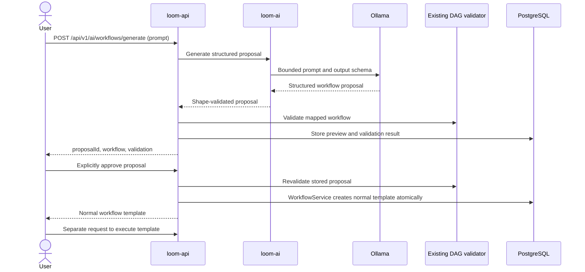

# AI workflow generation

Conductor extends Project Loom with one isolated AI service, `loom-ai` (port 8085).
It uses Spring AI 2.0.1 with the Spring Boot 4.1.1 baseline and one local Ollama
provider. No hosted-model API key is required. The LLM never controls scheduling
or task execution.

Spring AI's [stable compatibility guidance](https://docs.spring.io/spring-ai/reference/getting-started.html)
supports Boot 4.1. Its BOM is scoped to `loom-ai`; the existing Boot BOM remains
the runtime baseline. Only the Ollama model dependency is added, without vector
stores, embedding providers, memory, or agents. The provider sends a
[native Ollama JSON schema](https://docs.spring.io/spring-ai/reference/api/chat/ollama-chat.html),
then rejects malformed output and applies bounded shape validation. Graph checks
remain in the existing API validator.



## Boundaries and decisions

`loom-ai` contains provider invocation, structured-output conversion, bounded
shape checks, and AI metrics. It has no database credentials or Kafka execution
producer. Domain logic depends on a small workflow-model interface rather than
Ollama classes. A separate service costs one extra local process, but keeps model
timeouts and provider dependencies out of the scheduler and workers.

`loom-api` owns proposal persistence and Flyway migrations. Generated proposals
are mapped into the existing workflow representation and checked by Conductor's
deterministic DAG validator. Approval invokes the same `WorkflowService` path as
manual creation. Persisting previews avoids trusting a client to resubmit the
same content; database locking makes approval atomic. Proposals expire after
24 hours. Duplicate approval returns HTTP 409 instead of creating another
workflow. Approval never submits a job.

The only supported generated capability is `NOOP`: current workers simulate
tasks rather than downloading orders, generating invoices, or sending messages.
Task names describe an intended business flow, not implemented integrations.
Parallelism is a fixed DAG with explicit dependencies; schedules and dynamic
fan-out are outside this phase.

## Local configuration

AI is disabled by default. The optional Compose `ai` profile starts `loom-ai`
and a local Ollama container, with model files retained in the `ollama_models`
volume. Set these environment variables before starting the AI-enabled stack,
then install the selected model explicitly:

```powershell
$env:AI_ENABLED = 'true'
$env:AI_MODEL = 'qwen2.5-coder:7b'
.\scripts\compose.ps1 --profile ai up --build -d
.\scripts\compose.ps1 --profile ai exec ollama ollama pull qwen2.5-coder:7b
.\scripts\compose.ps1 --profile ai exec ollama ollama list
```

The container AI service defaults to `http://ollama:11434`; Ollama's port is not
published to the host. Starting Compose pulls the service images but does not
download a model. CPU inference can take substantial time; keep the API's
AI-call timeout greater than the model timeout. Model, temperature, and timeout
are environment-configurable; see `.env.example` and service configuration.

For a directly launched Java AI service, `OLLAMA_BASE_URL` defaults to
`http://localhost:11434`. Start host Ollama and explicitly run
`ollama pull qwen2.5-coder:7b` in that case. A container can optionally use
`OLLAMA_BASE_URL=http://host.containers.internal:11434` only when the host
listener is reachable from Podman. Windows Ollama normally listens on loopback,
so that address can fail even while host requests succeed. The container Ollama
service avoids requiring a broader unauthenticated host listener.

## Preview and approval API

```powershell
$body = @{ prompt = 'Create a workflow that downloads customer orders, validates them, generates invoices in parallel, uploads them and sends a notification.' } | ConvertTo-Json
$proposal = Invoke-RestMethod -Method Post -Uri 'http://localhost:8080/api/v1/ai/workflows/generate' -ContentType 'application/json' -Body $body
$proposal | ConvertTo-Json -Depth 20
```

Inspect `workflow.tasks` and `validation` before approval. Retrieve the stored
preview with `GET /api/v1/ai/workflows/proposals/{proposalId}`. An invalid graph
returns a preview with `validation.valid = false` and deterministic errors;
it does not create a workflow. Approval rechecks the stored proposal:

```powershell
$workflow = Invoke-RestMethod -Method Post -Uri "http://localhost:8080/api/v1/ai/workflows/proposals/$($proposal.proposalId)/approve"
Invoke-RestMethod -Uri "http://localhost:8080/api/v1/workflows/$($workflow.id)"
```

Execution is a separate normal API request:

```powershell
$job = Invoke-RestMethod -Method Post -Uri "http://localhost:8080/api/v1/workflows/$($workflow.id)/jobs" -ContentType 'application/json' -Body '{"name":"ai-workflow-demo"}'
Invoke-RestMethod -Uri "http://localhost:8080/api/v1/jobs/$($job.id)"
```

Invalid user requests return 400. Provider unavailability/timeouts return 503.
Malformed or invalid structured output returns 422. These failures do not affect
normal workflow APIs or execution. No raw provider exception or full prompt is
logged by default.

## Optional real-model smoke test

The script first generates and prints a preview. It requires explicit switches
to persist or execute, so inspect a preview before enabling them:

```powershell
.\scripts\ai-workflow-smoke.ps1
.\scripts\ai-workflow-smoke.ps1 -ProposalId '<id from preview>' -Approve
# Or approve and execute the inspected proposal in a single invocation:
.\scripts\ai-workflow-smoke.ps1 -ProposalId '<id from preview>' -Approve -Execute
```

Without `-ProposalId`, an invocation generates a fresh proposal. Supplying the
ID retrieves the stored preview without another model call, allowing approval
of exactly the DAG you inspected. Choose one approval command: a second approval
of the same ID is rejected. The execution variant approves, retrieves the normal
workflow, submits a normal job, and polls until completion or its bounded timeout.
It exercises the existing Kafka/scheduler/worker path;
it never calls a worker directly. Normal automated tests use fake models and
require neither Ollama nor a live model. A real-model run is optional and output
quality varies between local models.

Authentication and tenant isolation are not implemented in the existing
platform. Proposal endpoints are intended for local development, not public
deployment. RAG, failure analysis, copilot, optimization, and frontend AI are
not included in this phase.

## Verification

`./gradlew build` passed with 54 unit tests. `:loom-api:integrationTest` passed
15 tests, and `:loom-worker:integrationTest` passed 3 tests against Podman.
AI tests use fake models
or local HTTP stubs, including native schema delivery, malformed output,
unavailable providers, stalled response bodies, graph errors, expiry, concurrent
approval, and atomic transaction rollback.

On 2026-10-04, the real `qwen2.5-coder:7b` model generated the six-task orders
example with two invoice branches and a downstream join. Before approval, the
database contained no workflow templates. Proposal
`a26145fd-d129-4352-be8f-7d63d28f9662` was explicitly approved as workflow
`8c7ac234-aac5-4502-95bf-fde85809d4f6`; job
`7975a135-15f6-46fb-b928-e2f84afefa40` completed with all six tasks `COMPLETE`.
Duplicate approval returned 409. With Ollama stopped, generation returned 503
and a manually created workflow still executed to completion. Ollama was then
restored. AI counters and request duration were verified through the AI service's
Actuator Prometheus endpoint.

The successful model call took about 78 seconds on this CPU-only runtime.
Response quality and latency depend on the local model and hardware. The first
live response labelled a sequential task "parallel"; the prompt was clarified
with a concrete fork/join example. DAG validity alone cannot prove the user's
intended semantics, so inspect the preview before approval. Expired previews
remain stored; automatic retention cleanup is deferred. Original user prompts
are not stored with proposals.
